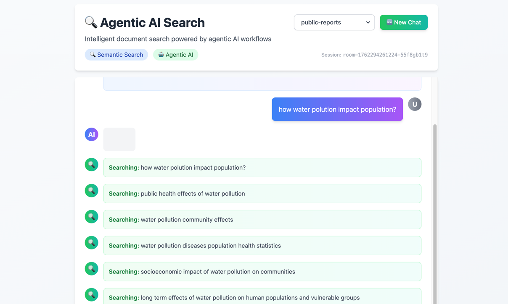
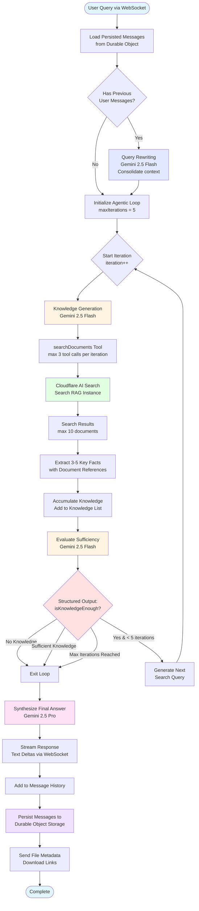

# Agentic AI Search

An intelligent document search system powered by agentic AI search. Uses autonomous multi-step reasoning to search, analyze, and synthesize information from document collections using Cloudflare Workers, AI Search, and Google Gemini.



## Features

[](https://deploy.workers.cloudflare.com/?url=https://github.com/G4brym/agentic-ai-search)

- 🤖 **Agentic AI Search** - Autonomous multi-step reasoning with Google Gemini
- 🔍 **Semantic Search** - Powered by Cloudflare AI Search
- ✏️ **Contextual Query Rewriting** - Automatically consolidates follow-up questions into context-aware queries
- 🧠 **Knowledge Synthesis** - Iteratively gathers and evaluates information
- 💬 **Modern Chat Interface** - Built with vanilla HTML, CSS (Tailwind), and jQuery
- ⚡ **Edge Deployment** - Runs on Cloudflare Workers
- 💾 **Persistent Sessions** - Room-based conversation history with automatic loading on reconnect
- 🔄 **Multi-RAG Support** - Switch between multiple RAG instances via dropdown (creates new room automatically)

## Setup

### 1. Install Dependencies

```bash
npm install
```

### 2. Configure Google API Key

Get your Google API key from [Google AI Studio](https://aistudio.google.com/apikey)

**For local development:**
Create a `.dev.vars` file in the root directory:

```bash
cp .dev.vars.example .dev.vars
```

Then edit `.dev.vars` and add your API key:

```
GOOGLE_GENERATIVE_AI_API_KEY=your_actual_api_key_here
```

**For production deployment:**
Set the secret using Wrangler:

```bash
npx wrangler secret put GOOGLE_GENERATIVE_AI_API_KEY
```

Or set it in the Cloudflare dashboard under Workers > Your Worker > Settings > Variables

### 3. Configure AI Search Instance

The application uses AI Search instances for document retrieval. Make sure:
- You have one or more AI Search instances in your Cloudflare account
- Your documents are indexed in the AI Search instances
- The AI binding is configured in `wrangler.jsonc` (already done)
- The default RAG instance in `src/index.ts` can be changed if needed (currently `public-reports`)

The UI automatically detects and lists all available RAG instances in a dropdown menu.

### Session Management

The application uses persistent room-based sessions with the following behavior:

- **Room Persistence**: Each chat session has a unique room ID stored in localStorage
- **Message History**: When reconnecting to an existing room, all previous messages are automatically loaded and displayed
- **RAG Switching**: Changing the RAG instance automatically creates a new room since different RAGs contain different document collections
- **New Chat**: Click "New Chat" button to start a fresh conversation in a new room while preserving the previous room's history

## Development

Run locally:

```bash
npm run dev
```

The chat interface will be available at `http://localhost:8787`

## Deployment

Deploy to Cloudflare Workers:

```bash
npm run deploy
```

## How It Works

1. **User Query** - User asks a question through the chat interface
2. **Query Rewriting** - If there are previous user queries in the session, Gemini 2.5 Flash consolidates them into a single, contextually-aware search query
3. **Agentic Loop** - Autonomous reasoning loop with up to 5 iterations
4. **Search & Extract** - Agent searches documents and extracts relevant knowledge
5. **Evaluate Sufficiency** - Structured decision on whether more information is needed
6. **Iterate or Complete** - Continue with new search queries or finalize answer
7. **Synthesize Response** - Agent generates comprehensive answer from accumulated knowledge
8. **Persist Session** - Conversation saved to room-specific Durable Object storage

## Tech Stack

- **Frontend**: Vanilla HTML, Tailwind CSS, jQuery
- **Backend**: Cloudflare Workers (TypeScript)
- **AI Model**: Google Gemini 2.5 Pro & Flash
- **AI SDK**: Vercel AI SDK with Agents SDK
- **Vector Search**: Cloudflare AI Search
- **Storage**: Cloudflare Durable Objects
- **Deployment**: Cloudflare Workers

## API Endpoints

### GET `/api/rags`

Lists all available RAG instances.

**Response:**
```json
{
  "success": true,
  "rags": [
    {
      "id": "public-reports",
      "enable": true,
      "type": "r2",
      "source": "gov-public-dataset",
      "paused": false,
      "status": "waiting",
      ...
    }
  ]
}
```

### POST `/api/chat`

Main chat endpoint for AI agent interactions.

**Request:**
```json
{
  "message": "What information is available about...?"
}
```

**Response:**
```json
{
  "message": "Based on the search results...",
  "sources": [
    {
      "file_id": "doc123",
      "filename": "healthcare-policy-2020.pdf",
      "score": 0.85,
      "content": [...]
    }
  ],
  "steps": 2
}
```

## Architecture

### Agentic Loop Flow



### Component Overview

**Frontend (WebSocket Client)**
- Vanilla HTML, Tailwind CSS, jQuery
- Real-time bi-directional communication
- Multi-RAG instance selector
- Session-based chat rooms

**Backend (Cloudflare Workers)**
- `SearchAgent` - Durable Object class extending `AIChatAgent`
- Persistent message storage per room
- Multi-step agentic reasoning loop
- Document retrieval and streaming

**Query Rewriting Phase**
- Triggered when user sends follow-up queries in the same session
- Consolidates all previous user queries into context-aware search query
- Handles conversational refinements (e.g., "and without a tire" → "can a car run without a tire")
- Maintains conversation continuity while keeping searches focused

**Agentic Loop Process**
1. **Knowledge Generation Phase** (Gemini Flash)
   - Uses `searchDocuments` tool to query Cloudflare AI Search
   - Can perform up to 3 searches per iteration
   - Extracts 3-5 key knowledge entries from results
   - Accumulates knowledge across iterations

2. **Evaluation Phase** (Gemini Flash)
   - Structured output with Zod schema
   - Determines if accumulated knowledge is sufficient
   - Generates next search query if more info needed
   - Considers query coverage, gaps, and context

3. **Stopping Conditions**
   - Knowledge deemed sufficient
   - Maximum 5 iterations reached
   - No new knowledge extracted
   - No next search query generated

4. **Synthesis Phase** (Gemini Pro)
   - Combines all accumulated knowledge
   - Generates comprehensive, structured answer
   - Streams response in real-time
   - Excludes document citations (links sent separately)

**Storage & Persistence**
- Durable Objects for stateful WebSocket connections
- Room-based message history
- Automatic state synchronization
- File metadata tracking

## Environment Variables

- `GOOGLE_GENERATIVE_AI_API_KEY` - Your Google AI API key (required)

## License

MIT
