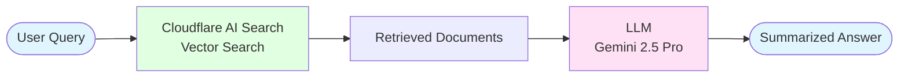
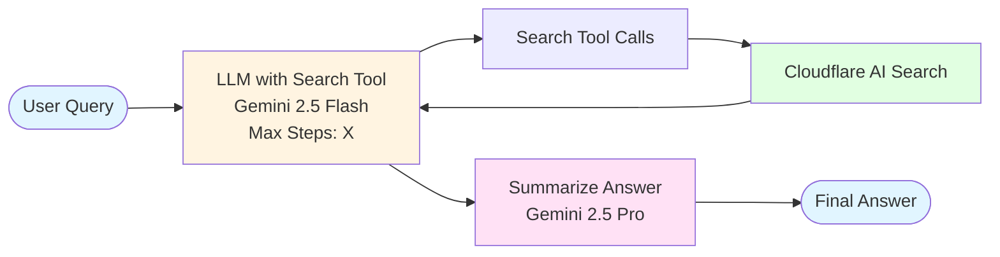
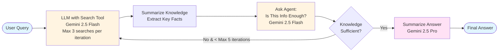
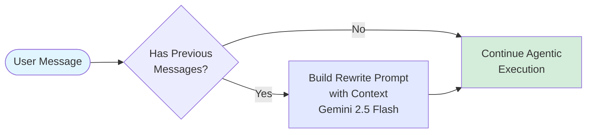
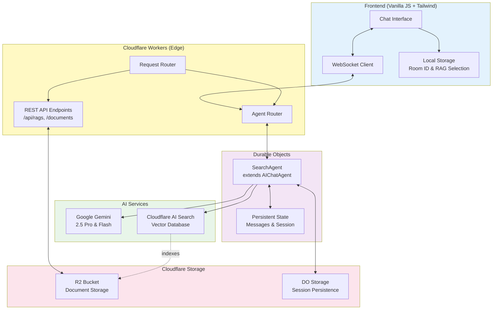
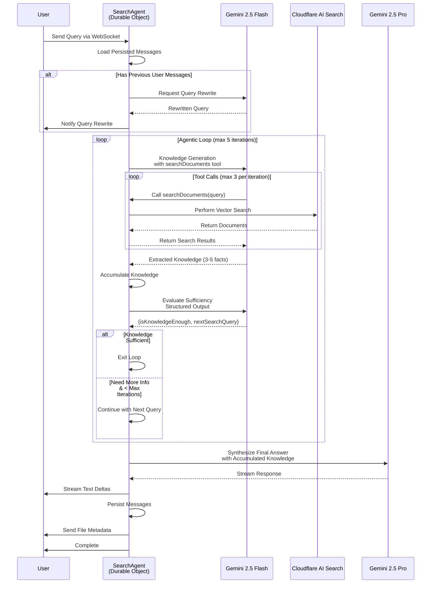

# Agentic AI Search - Architecture Diagrams

This document contains various architecture diagrams illustrating the evolution from simple RAG to advanced agentic AI search.

---

## 1. Simple RAG Search

A basic RAG (Retrieval-Augmented Generation) system with direct search and response.



**Characteristics:**
- Single search query
- No iterative refinement
- Direct answer generation
- Limited context understanding

---

## 2. Basic Agentic AI Search

Enhanced RAG with an LLM agent that can use search tools with multiple steps.



**Characteristics:**
- LLM with search tool capability
- Multiple tool calls (up to max steps)
- Simple agent-driven search
- Direct answer synthesis

---

## 3. Advanced Agentic AI Search

Sophisticated agentic system with knowledge accumulation and sufficiency evaluation.



**Characteristics:**
- Multi-iteration knowledge gathering (up to 5 loops)
- Multiple searches per iteration (up to 3)
- Knowledge accumulation across iterations
- Structured sufficiency evaluation
- Intelligent stopping conditions
- Comprehensive final synthesis

---

## 4. Query Rewrite Feature

Contextual query consolidation for follow-up questions in conversations.



**Example:**

```
Previous Queries:
1. "Can a car run without an engine?"
2. "What about without a transmission?"

Current Query:
3. "And without a tire?"

Rewritten Query:
→ "Can a car run without an engine, transmission, or tire?"
```

**Benefits:**
- Maintains conversation context
- Self-contained search queries
- Better search relevance for follow-ups

---

## 5. System Architecture Overview

Complete system architecture showing all components.



---

## 6. Comparison: Simple vs Basic vs Advanced

| Feature | Simple RAG | Basic Agentic | Advanced Agentic |
|---------|-----------|---------------|------------------|
| **Search Iterations** | 1 | Multiple (up to max) | Multiple (up to 5) with evaluation |
| **Query Rewriting** | ❌ | ❌ | ✅ Contextual |
| **Knowledge Accumulation** | ❌ | ❌ | ✅ Across iterations |
| **Sufficiency Evaluation** | ❌ | ❌ | ✅ Structured output |
| **Tool Use** | ❌ | ✅ Basic | ✅ Advanced with limits |
| **Session Persistence** | ❌ | ❌ | ✅ Durable Objects |
| **Streaming Response** | ✅ | ✅ | ✅ |
| **Multi-RAG Support** | ❌ | ❌ | ✅ |
| **Document Tracking** | ❌ | ❌ | ✅ With metadata |

---

## 7. Agentic Loop Detailed Flow

Detailed breakdown of the agentic loop iteration process.



---

## Conclusion

This architecture represents a significant evolution from simple RAG systems, incorporating:

1. **Agentic Reasoning**: LLM-driven decision making for search strategies
2. **Knowledge Accumulation**: Building comprehensive context across multiple searches
3. **Intelligent Evaluation**: Structured assessment of information sufficiency
4. **Contextual Awareness**: Query rewriting based on conversation history
5. **Production-Ready**: Session persistence, streaming, and multi-tenancy support

The system runs entirely on Cloudflare's edge infrastructure, providing low-latency, globally distributed AI-powered document search.
